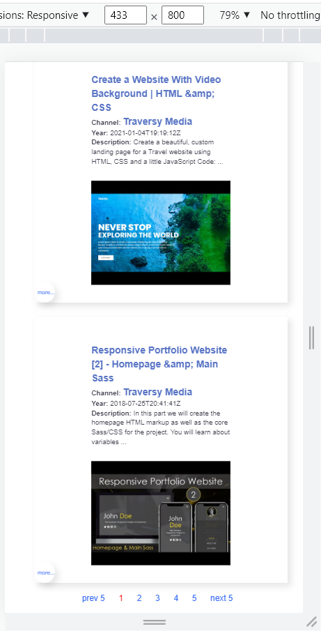

# Tatjana Marković YouTube API - FrontEnd

## Table of contents

  - [Instruction](#instruction)
  - [Overview](#overview)
  - [Built with](#built-with)
  - [Links](#links)
  - [Screenshot](#screenshot)
  - [Author](#author)

## Instruction:
1. run server in development mode with
    npm start
2. find it on
    http://localhost:3000

## Overview
    YouTube-api is a web application that will allow the user to search for any video.
    The results will be displayed when the user writes to the search input or changes type (live search). 
    In the list of results, the video item has a circle on the bottom left that opens the details of the video when clicked.
    click:
    - image or title video - takes you to the page for watching the video, 
    - channel title - takes you to the channel page, 
    - playlist title - fetch  the playlist videos

## Build with 
    1. React.js
    2. StyledComponents
    3. ReactRouterDom
    4. ReactLoaderSpinner

## Links

- GitHub - [youtube-api](https://github.com/tatjama/youtube-search)
- Live - [youtube-api](https://youtube-search-git-dev-tatjana.vercel.app/)

### Screenshot

## Author
- Website - [Tatjana Markovic](https://my-react-portfolio-tatjana.vercel.app/)
- LinkedIn - [Tatjana Marković](https://www.linkedin.com/in/tatjana-markovi%C4%87-919501189/)
- GitHub - [tatjama](https://github.com/tatjama)

